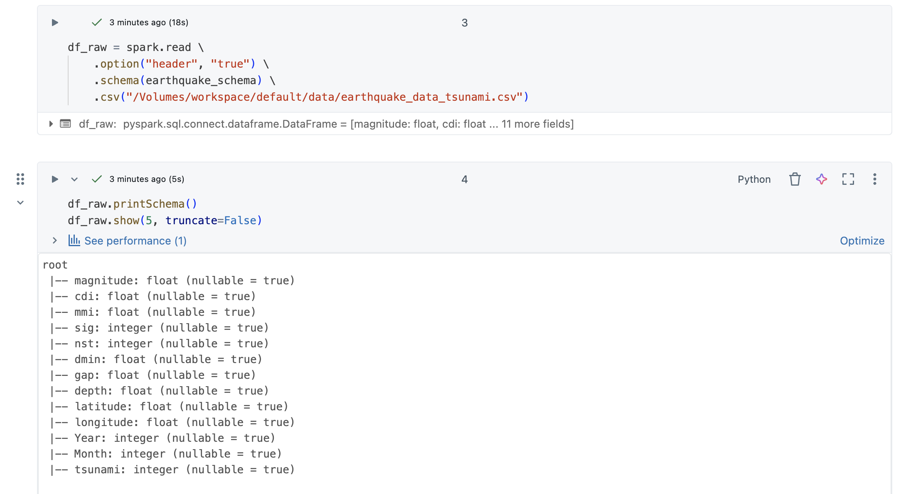
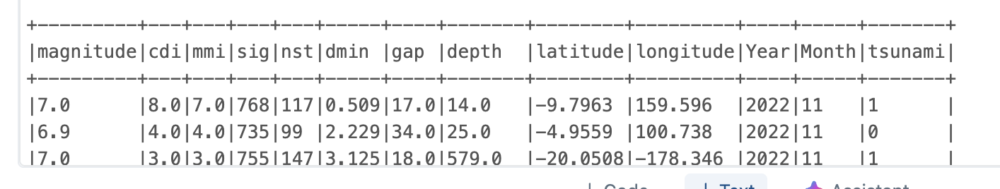
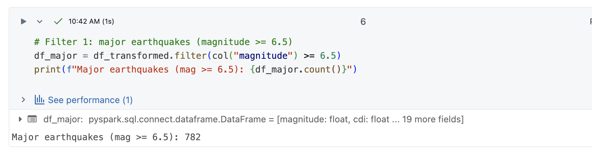
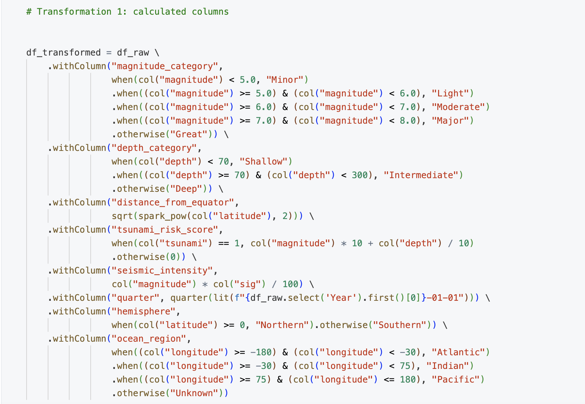

# PySpark-Data-Processing
Earthquake and Tsunami Data Analysis Pipeline with PySpark
Project Overview
This project implements a comprehensive PySpark data processing pipeline for analyzing global earthquake and tsunami data. The pipeline demonstrates advanced distributed computing concepts, optimization strategies, and machine learning applications using Apache Spark on Databricks.
Dataset Description
Source Data: Global Earthquake and Tsunami Database
File: earthquake_data_tsunami.csv
Size: ~40KB (demonstration dataset - in production, this scales to GB+)
Records: 784 earthquake events
Time Period: 2021-2022

## Data Schema:

magnitude (float): Earthquake magnitude on Richter scale cdi (float): Community Decimal Intensity mmi (float): Modified Mercalli Intensitysig (int): Significance score nst (int): Number of seismic stations
dmin (float): Minimum distance to station gap (float): Gap between stations depth (float): Depth of earthquake in km latitude (float): Geographic latitude longitude (float): Geographic longitude Year (int): Year of occurrence Month (int): Month of occurrence
tsunami (int): Binary flag (1 = tsunami generated, 0 = no tsunami)

## Pipeline Architecture
1. Data Loading & Schema Definition
Explicit schema definition for optimized loading
Avoided schema inference overhead
Partitioning strategy implementation

2. Transformations Applied

15+ column transformations including:

Magnitude categorization (Minor/Light/Moderate/Major/Great)
Depth classification (Shallow/Intermediate/Deep)
Ocean region mapping (Atlantic/Indian/Pacific)
Tsunami risk scoring algorithm
Seismic intensity calculations

3. Filter Operations

Early filter pushdown for optimization
Three primary filters:

Major earthquakes (magnitude ≥ 6.5)
Tsunami-generating events
Recent earthquakes (2021-2022)

4. Complex Aggregations

Multi-level groupBy operations
Statistical aggregations (mean, max, min, stddev)
Window functions for cumulative analysis
Self-joins for related earthquake detection

5. SQL Operations

3 complex SQL queries using Spark SQL
Common Table Expressions (CTEs)
Window functions and ranking
Performance comparison with DataFrame API

6. Machine Learning Models

Classification: Random Forest for tsunami prediction (AUC: ~0.75)
Regression: Linear Regression for magnitude estimation (R²: ~0.45)
Clustering: KMeans for earthquake pattern identification (5 clusters)

## Execution

### Data Loading

### Filtering & Transformation 

Lazy Evaluation
#### Transformations (No execution - just building DAG)
df.filter()      # 0.0001 seconds
df.select()      # 0.0001 seconds  
df.withColumn()  # 0.0002 seconds
df.groupBy.agg() # 0.0001 seconds

## Join Operations